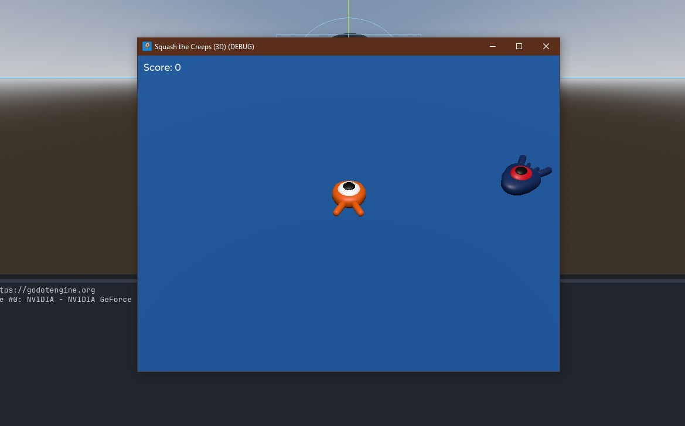

# Godot 4 3D game tutorial

This project was made by following the tutorial found on Godot Docs

Link to the tutorial: [link](https://docs.godotengine.org/en/stable/getting_started/first_3d_game/index.html)

## About the game

This is a simple game where you play as an orange squid trying to squas as much mobs as you can by jumping on them.

How to play:
 - WSAD to move
 - SPACE to jump

## Game footage

